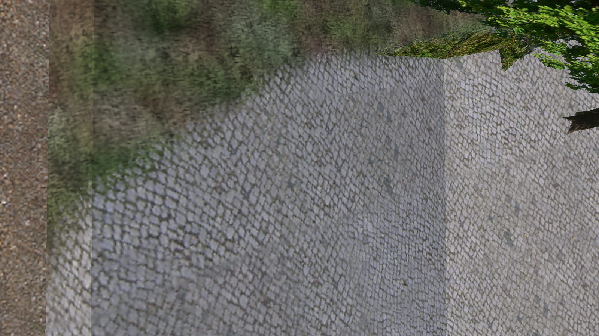
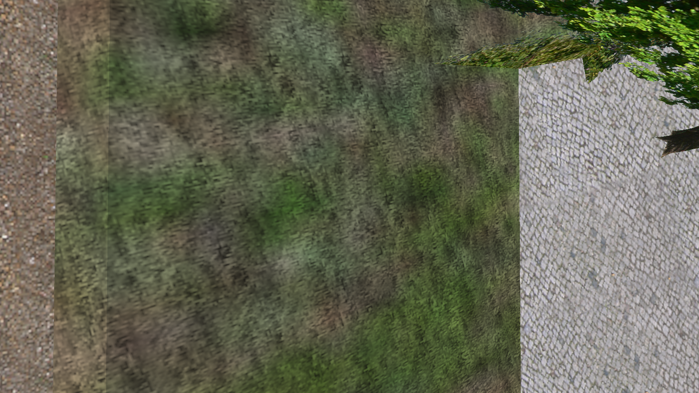
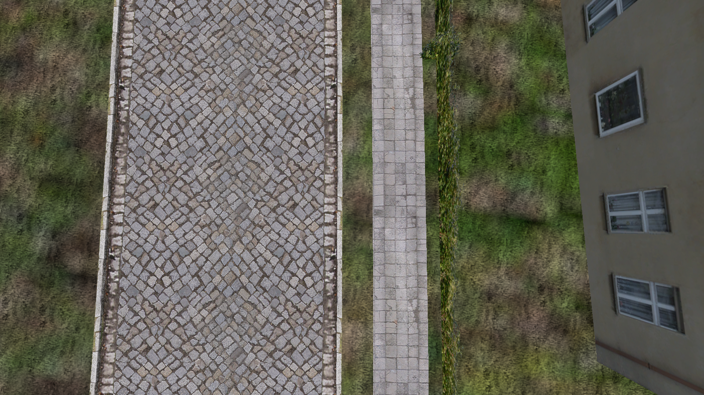
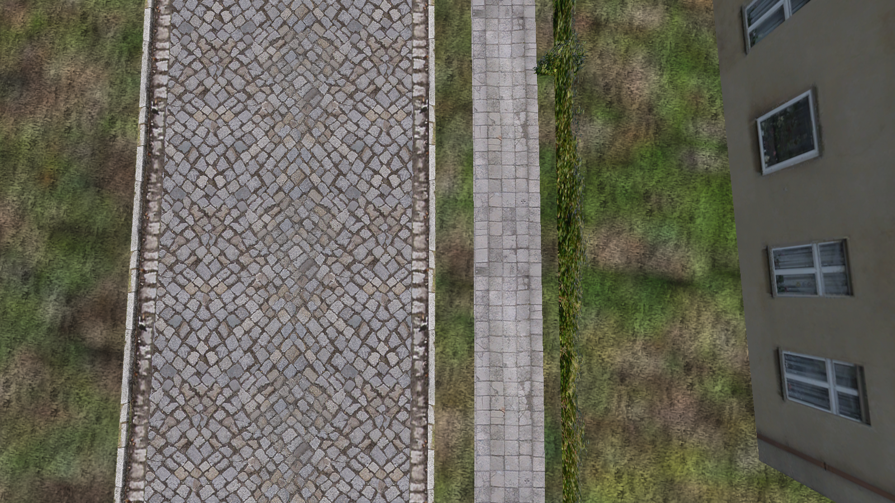

# Stock-map rendering comparison

Original, unedited openOMSI screenshots of the installed stock Berlin-Spandau map.
Before: official [v0.1.479](https://github.com/turbo-devv/openOMSI/releases/tag/v0.1.479), `b15f5cb9b65503fbe121d9fcaab1021ce1285cdd`.
After: graphics-only source `41f128473df3eaa158a101fd542e9570101222f6`, based on main `def0f02`.
Between the official baseline and the PR base, rendering/terrain code is unchanged;
the code differences concern mouse input/zoom, which these offscreen captures do not use.

Each pair uses the same camera, date, time, map, random seed and graphics settings.
The images are the application's original PNG output. No game asset files are included.
Reproduction parameters and SHA-256 hashes are in [evidence.json](evidence.json).

## First terrain layer on mapped splines

The sloping Damm1 embankment uses the first ground material after the fix, instead
of inheriting the painted cobblestone layer underneath. Sloping and level surfaces
can still differ in lighting because their normals differ.

| Before | After |
| --- | --- |
|  |  |

## Matching ground lighting

Flat mapped grass beside the Freimuthstrasse kerb and the surrounding terrain use
the same ground lighting rules. Cutout terrain no longer takes the foliage lighting path.

| Before | After |
| --- | --- |
|  |  |
